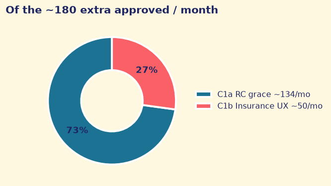
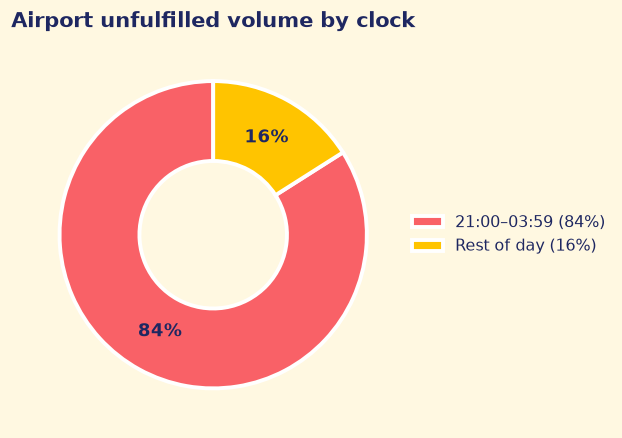
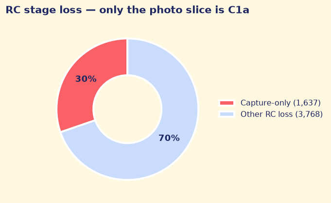
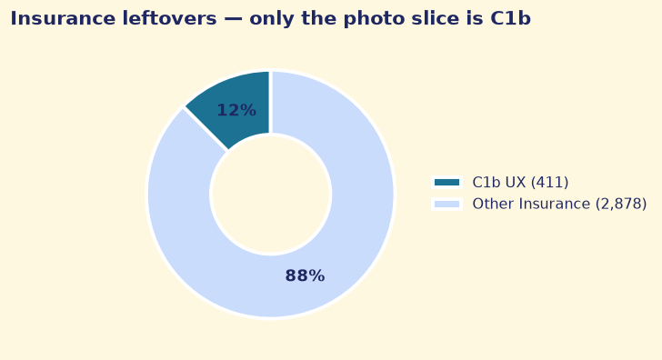
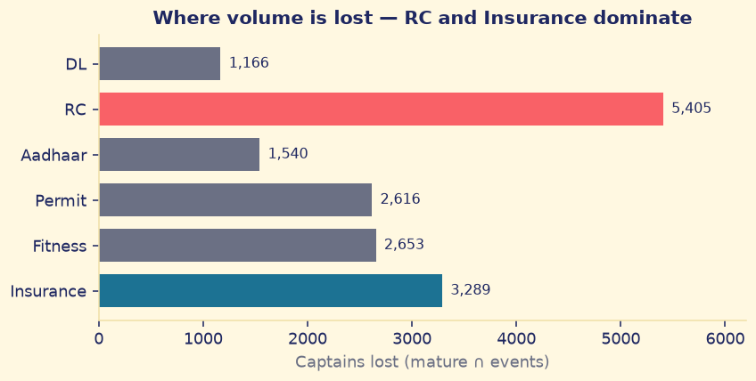

# Memo to the Head of Supply

**Captain onboarding leak and overnight airport**  
Ramanathan K R · 10 Sep 2026 · extract 30 Jun 2026, 23:59 IST

---

**The ask.** Ship two photo-quality fixes and recover about **180 approved captains a month**. Do **not** hire the airport catchment. Stop scaling CAMP_WA_002. Medium confidence on 180; the campaign call is a hard no.

These approvals are not hollow: **98.7%** of mature approved captains already take a first trip (3,895 / 3,946). Documents are the bottleneck.

---

## What to do this week

| # | Do this | Impact | Cost / risk | Watch |
|---|---|---|---|---|
| **1** | **C1b this week:** Insurance camera UX (411 people). Then **C1a** after Legal: 10-day in-person RC grace (1,637). Same camera on other docs is a free rider — **not** in the 180. | **~180/mo** (~50 + ~134). Disjoint groups. | C1b is engineering only. C1a needs Legal/T&S and ~1 FTE (~₹40–60k, assumed). | Approved by cohort |
| **2** | **Airport Return Assurance** at **₹35.4 per unpaid night-suburban leg.** Do not hire near the airport. | Restores rest-of-day suburban economics. Sample ~₹69–103k/month. | Trips file is sampled — not a city P&L. Pay rest-suburban, not city-core. | Return in 20 min, cancels, **falling** 4-week payout run-rate |
| **3** | Kill the 5× WhatsApp. Run send vs no-send on RC-cleared app/paid captains only. | Cost avoided + a real answer in 4–6 weeks | Near zero | Aadhaar pass and approved |

**Why rec 2 is “do not hire.”** Terminals run ~40% unfulfilled vs ~3% elsewhere. **84%** of that pain is 21:00–03:59 (~13 captains online vs ~37 by day). After the trip, suburban backhaul and overnight return-collapse **compound**. Mix does **not** shift after dark (χ² p=0.12). New hires inherit both penalties. Price the deadhead first.

**CAMP_WA_002 is 0 pp.** Clicked vs not (delivered) is −1.5pp (CI −3.6 to +0.6). The 29% vs 11% “got the campaign” gap is targeting after RC, not lift. Do not fund 5×. That same null is why we do not WhatsApp the never-upload pile.

---

## Why these two stages, and what would change my mind

**RC and Insurance fail as photographs, not as papers.** RC loses 5,405 — the largest stage — but only **1,637** failed solely on blur / OCR / illegible.

Retry pass rates go **up** (65% → 74%). RC is vehicle identity, so a 10-day in-person grace is scoped. Insurance loses 3,289, but ~2,530 never uploaded after Fitness; C1b is only the **411** photo fails and **cannot** defer (liability). DL (1,166) cannot be deferred. Aadhaar / Permit / Fitness losses are real (1,540 / 2,616 / 2,653) but mostly never-upload or eligibility. A camera does not fix those. Rejected 409 already cleared docs — a gate, not a UX leak.

**How 134 and ~50 are built**

| Fix | Flow | Maths | Bank |
|---|---|---|---|
| C1a RC grace | ~300/month capture-only | × 60% show-up × 74% pass | **~134/mo** |
| C1b Insurance UX | 411 capture-only | retry 67→76% × 91% approved-if-cleared | **~46–52/mo** |

Show-up is unobserved (40–80% → ~89–188). If Legal will not treat deferred RC as activation, remaining-funnel conversion is 27% and C1a shrinks toward **~36/month**.

**ARA maths.** Night-suburban net ₹24.9 vs rest-suburban ₹56.5 → gap ₹31.6. ARA pays only the 89.31% with no return in 20 min → **31.6 / 0.8931 ≈ ₹35.4**/leg. 80/100/120% → sample ~₹69–103k/month. 30% of a ₹350 fare (₹105) overpays. City-core ₹104.7 is a different geography.

**Not banked.** Reuse C1b’s camera on every upload — measure, do not add to 180. Never-upload RC (~2,388) and Insurance (~2,530) is an **assist RCT**, not WhatsApp (CAMP was 0 pp; fos abandon after Fitness 26% vs paid 43%). Field vs app 128–256/month overlaps **726** of the C1a captains — do not add.

### What I assumed, and what would change my answer

- **~15.6-day cutoff** (max `in_progress` age). Later capture-fails still in flight → 180 is a floor; if they finish alone, a slight overstatement.
- **`doc_events.verification_pass`**, not `approvals.docs_cleared` (they disagree only while unfinished).
- **Field vs app not banked** until a randomised assist test on ordinary app/paid signups.
- **ARA matches rest-suburban, not city-core.** If night returns rise, re-derive ₹35.4; do not freeze it.
- **C1a ops ₹40–60k** assumes one FTE at 12–15 checks/day.

No CAC in the extract — cannot price field vs paid. `airport_trips.csv` is sampled: rates hold; ₹/month is not a city budget. `signup_zone_id` does not join airport zones.
